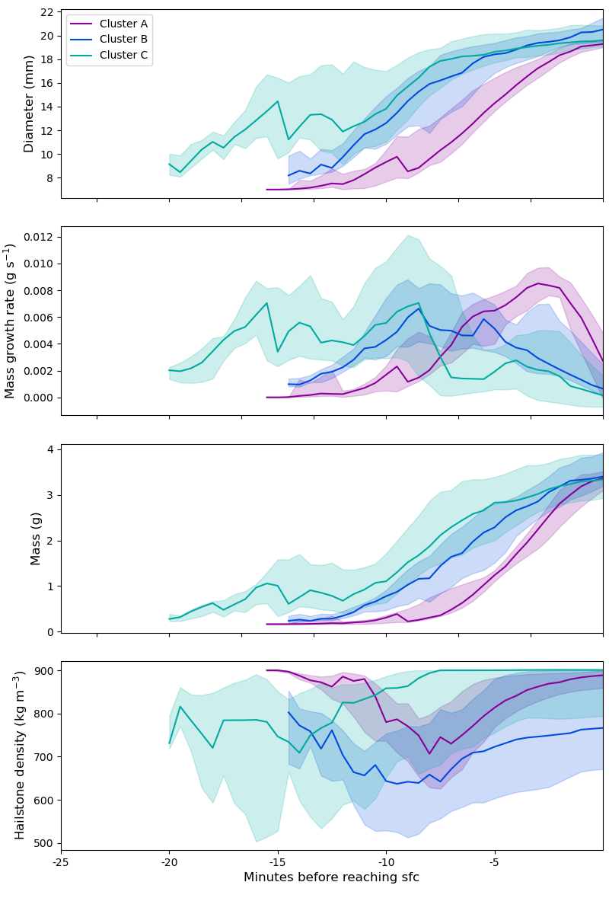
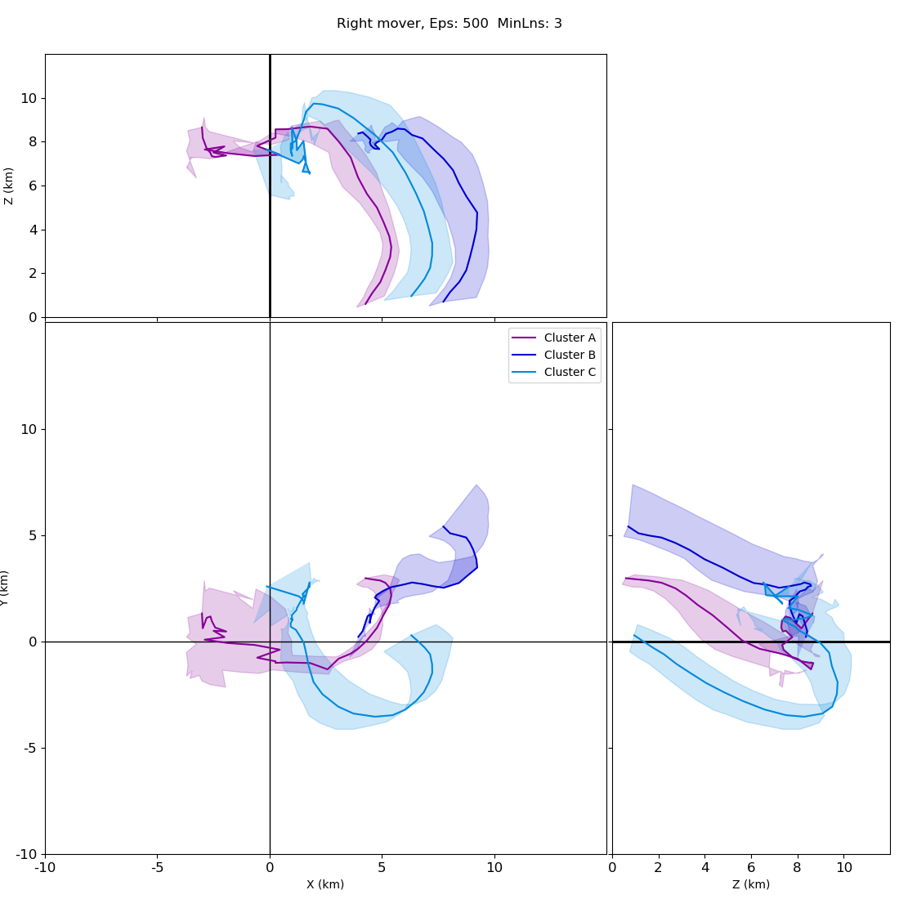

# Hail Trajectory Clustering
The code within this repository is described in the journal article *Adams-Selin, R., 2022: A three-dimensional trajectory clustering technique. Submitted to Monthly Weather Review.*

 Permission is granted for an individual or an institution to use this software provided that:

- If you redistribute any portion of the software, whether in original or modified form, this copyright and no-warranty information is kept in a conspicuous location and that all references to this notice are maintained.
- Should you utilize the results of this software in your research, we request that you appropriately cite the above reference in any associated publications.
- The software or any modified version of the software may not be incorporated into proprietary software or commercial software offered for sale.
- This software is provided as is without any express or implied warranties.

The following describes the steps necessary to produce clusters of hail trajectories. They include:

1. [Ready the data for input.](#1-ready-data-for-input) [Sample data preparation scripts are provided.](#1a-prepare-the-data)
2. [Partition the trajectories.](#2-partition-the-trajectories)
3. [Perform the distance matrix calculation.](#3-perform-the-distance-matrix-calculation)
4. [Run the hyperparameter grid search](#4-run-a-hyperparameter-grid-search-to-identify-optimum-hyperparameters) to identify optimum hyperparameters. This step includes the [partition (or subtrajectory) clustering](#4a-perform-the-partition-subtrajectory-clustering), and the [merging/grouping by common parent trajectories](#4b-merge-clusters-by-common-parent-trajectories).
5. [Plot the clusters and merged clusters](#5-plot-the-clusters-and-merged-parent-clusters). Select the desired hyperparameter pair for all further analysis.
6. [Identify "superclusters" by hand. Calculate a representative trajectory for each.](#6-identify-superclusters-by-hand-and-calculate-a-representative-trajectory-for-each)
7. [Perform analysis and visualization of superclusters.](#7-analysis-and-visualization-of-superclusters)
<br/><br/>

## 1. Ready data for input.

- The trajectory code expects a netcdf file with the following format. Traj is number of trajectories. 
```
netcdf cm1out_haildata_traj_leftWrelative {
dimensions:
        traj = 220 ;
        time = 151 ;
variables:
        float x(traj, time) ;
        float y(traj, time) ;
        float z(traj, time) ;
        float time(time) ;
                time:units = "seconds" ;
```
- The code will also carry any “trajectory characteristics” along for the ride when doing the clustering, so you can interrogate this information within each cluaster. I have it set up to look for these variables when reading in:
```
        float u(traj, time) ;
        float v(traj, time) ;
        float w(traj, time) ;
        float d(traj, time) ;
        float dense(traj, time) ;
        float tv(traj, time) ;  #terminal velocity, m/s
        float ts(traj, time) ;  #hailstone temperature, K
        float fw(traj, time) ;  #water fraction
        float dice(traj, time) ; #ice-only diameter
        float qice(traj, time) ; #ice mixing ratio kg/kg
        float qliq(traj, time) ; #liquid mixing ratio kg/kg
        float tc(traj, time) ;   #cloud temperature K
        float mass(traj, time) ; #hailstone mass (g)
```
 <ul> <li style="list-style-type: none;">You could change these to anything - one of them could be “insert time”, the time the trajectory is inserted into the storm, for example. The code just treats these as dumb floating point numbers and calculates percentile distributions after the clustering is complete.</li> </ul>

- Missing data should be set to -9999. Because of the format, likely the last several timesteps of most trajectories will be set to -9999, since they aren’t all the same length.

- The trajectories should be storm-relative, with the x, y, z above cacluated with respect to the updraft center at each timestep.

- Store this file in a directory of your choice, we’ll call it `$CASE_NAME`. Within that directory, you’ll need the following subdirectories:
```
        subtraj, cluster, merged_clusters, repr_traj, plots
```

### 1A. Prepare the data
- Several scripts are available in the prep_data directory to prepare CM1 HAILCAST hail trajectory output for the hail trajectory code, as described above. These include:
    - `Pickle_haildata.py` reads in all the cm1out_haildata.nc trajectories, retains only those larger than a given threshold, and stores the data in a python pickle file (easier than netcdf for space purposes)
   - `Updraft_filtering_lanczos.py` Using the CM1 output files, calculate the updraft center using a low-pass Lanczos filter, as described in the article. Write updraft center out to a text file.
    - `make_traj_updraft_relative.py` Using that text file and the pickle files, create a new netcdf file containing updraft-relative hail trajectories, in the desired format.

<br/><br/>
## 2. Partition the trajectories.

- This step breaks each trajectory up into “subtrajectories” (or partitions, or segments), which are what is actually clustered. It uses information theory to determine how few partitions it needs to divide a trajectory into but still retain important information (e.g., loops).
- `Traj_part.f90` is the code, it uses the netcdf library and included `MDL.f90` and `distance_functions.f90` fortran modules.
- *Inputs:*
```
    $CASE_NAME/$RST_NUM/$FILE_PREFIX.nc
```
 
 <ul> <li style="list-style-type: none;">which contain the prepared file produces by step 1, above. $RST_NUM can be used if you have produce multiple sets of hail trajectories, such as for multiple CM1 restart runs. Can be changed at start of code.</li> </ul>

- *Compile:*
```
    gfortran -o traj_part distance_functions.f90 MDL.f90 traj_part.f90
    -I/opt/local/include  -L/opt/local/lib -lnetcdf -lnetcdff
``` 
<ul> <li style="list-style-type: none;">Just replace the /opt/local paths to your local netcdf installation, and gfortran with your version of fortran.</li> </ul>

- *Run:* 
```
    ./traj_part case_name file_prefix rst_num
``` 
<ul> <li style="list-style-type: none;">Where “case_name” is, unsurprisingly, your case name ($CASE_NAME from the previous step). It uses this info to construct where it expects the input directory to be. $FILE_PREFIX is the prefix used in all your output filenames. It can be the same as $CASE_NAME if you want. $RST_NUM described above. </li> </ul>

- *Output:* 
```
    $CASE_NAME/subtraj/$FILE_PREFIX_subtraj.txt
    $CASE_NAME/subtraj/$FILE_PREFIX_subtraj_chars.txt
```
<ul> <li style="list-style-type: none;">The first file contains the endpoints of each identified subtrajectory and the parent trajectory it came from. The second contains the characteristics you’ve included, at each subtrajectory endpoint.</li> </ul>

<br/><br/>
## 3. Perform the distance matrix calculation.

- A distance matrix is the distance value calculated between each pair of subtrajectories. It can get large, so it is stored in unformatted binary. “Distance” is a special calculation I designed that increases for spatial distance, but also (in fact, more) for changes in orientation. 
- The hyperparameters are “Eps” (epsilon) and “MinLns” (minimum num. of lines) for the DBSCAN clustering method, which is what I’m (basically) using.  These are best described in [this article](https://medium.com/@agarwalvibhor84/lets-cluster-data-points-using-dbscan-278c5459bee5). The code attempts to calculate the best ones through an entropy minimization function. These are only the best for the segment clusters, not for the parent clusters like in the article, but it provides a good starting point.
- The code is prep_cluster.f90, and it uses the included distance_functions.f90, entropy.f90 and sumulated_anneal.f90 fortran modules.
- *Compile:*
```
    gfortran -fopenmp -o prep_cluster distance_functions.f90 entropy.f90   
        simulated_anneal.f90 prep_cluster.f90
```
<ul> <li style="list-style-type: none;">Because the distance matrix is so large, I have this coded to use omp threading to parallelize and speed things up.</li> </ul>

- *Run:* 
```
    ./prep_cluster  $CASE_NAME/subtraj  $FILE_PREFIX
```

- *Output:* 
```
    $CASE_NAME/subtraj/$FILE_PREFIX_distance.bin
    $CASE_NAME/subtraj/$FILE_PREFIX_prepcluster.out
```
<ul> <li style="list-style-type: none;">The prep_cluster.out file contains a print out of the optimal Eps and MinLns variables at the end of it. Distance.bin is the unformatted binary distance matrix.</li> </ul>


<br/><br/>
## 4. Run a hyperparameter grid search to identify optimum hyperparameters.

- This code runs the following two steps, subtrajectory clustering (4a) and merging common clusters (4b), repeatedly using a range of different Eps and MinLns values. You’ll want to define the range at the top of the code to include the Eps and MinLns values you identified at the end of the previous step.

- *Inputs:*
```
    $CASE_NAME/subtraj/$FILE_PREFIX_distance.bin
    $CASE_NAME/subtraj/$FILE_PREFIX_subtraj.txt
    $CASE_NAME/subtraj/$FILE_PREFIX_subtraj_chars.txt
```
- *Run:* 
```
    python hyperparameter_grid_search.py
```
<ul> <li style="list-style-type: none;">after you’ve defined the epss and minlnss arrays at the top of the script.</li> </ul>

- *Output:* 
```
    $CASE_NAME/$FILE_PREFIX_entropy.txt
    $CASE_NAME/$FILE_PREFIX_noise.txt
    $CASE_NAME/$FILE_PREFIX_combo.txt
    $CASE_NAME/plots/hyperparameter_all.png
```
<ul> <li style="list-style-type: none;">These show the value of the entropy, noise, and combination arrays as discussed in the paper. The Eps and MinLns value that minimizes the combo array is likely the best option. </li> </ul>

### 4A. Perform the partition (subtrajectory) clustering.

- *Inputs:*
```
    $CASE_NAME/subtraj/$FILE_PREFIX_distance.bin
    $CASE_NAME/subtraj/$FILE_PREFIX_subtraj.txt
    $CASE_NAME/subtraj/$FILE_PREFIX_subtraj_chars.txt
```
- *Compile:*
```
    gfortran -o cluster distance_functions.f90 cluster_module.f90 cluster.f90
```
- *Run:* 
```
    ./cluster  $CASE_NAME $FILE_PREFIX $EPS $MINLNS
```
<ul> <li style="list-style-type: none;">where $EPS and $MINLNS come the end of the prepcluster.out file in the previous step. I round each to the nearest whole number for easier file naming purposes.</li> </ul>

- *Output:* 
```
    $CASE_NAME/cluster/$FILE_PREFIX_$EPS_$MINLNS_cluster_*.txt
    $CASE_NAME/cluster/$FILE_PREFIX_$EPS_$MINLNS_cluster_chars*.txt
    $CASE_NAME/cluster/$FILE_PREFIX_$EPS_$MINLNS_cluster.log
```
<ul> <li style="list-style-type: none;">These are the same in format to the subtraj.txt and subtraj_chars.txt files, just only for the segments in each cluster. You have one of each of these files for each cluster it identifies. </li> </ul>

### 4B. Merge clusters by common parent trajectories.

- This code runs the following two steps, subtrajectory clustering (4a) and merging common clusters (4b), repeatedly using a range of different Eps and MinLns values. You’ll want to define the range at the top of the code to include the Eps and MinLns values you identified at the end of the previous step.

- *Inputs:*
```
    $CASE_NAME/subtraj/$FILE_PREFIX_subtraj.txt
    $CASE_NAME/subtraj/$FILE_PREFIX_subtraj_chars.txt
    $CASE_NAME/cluster/$FILE_PREFIX_$EPS_$MINLNS_cluster_*.txt
    $CASE_NAME/cluster/$FILE_PREFIX_$EPS_$MINLNS_cluster_chars*.txt
```
- *Run:* 
```
    python merge_clusters.py $CASE_NAME $FILE_PREFIX $EPS $MINLNS
```
<ul> <li style="list-style-type: none;">where $EPS and $MINLNS are set by hyperparameter_grid_search.py. </li> </ul>

- *Output:* 
```
    $CASE_NAME/merged_clusters/$FILE_PREFIX_$EPS_$MINLNS_merged_*.txt
    $CASE_NAME/merged_clusters/$FILE_PREFIX_$EPS_$MINLNS_merged_chars*.txt
```
<ul> <li style="list-style-type: none;">These are the same in format to the cluster.txt and clusters_chars.txt files, just for the parent (merged) clusters instead. </li> </ul>

<br/><br/>

# 5. Plot the clusters and parent clusters.

- Make individual 3d plots of each cluster or parent (merged) cluster. Useful for determining subjectively how effective a round of clustering has been.

- *Inputs:*
```
    $CASE_NAME/subtraj/$FILE_PREFIX_subtraj.txt
    $CASE_NAME/cluster/$FILE_PREFIX_$EPS_$MINLNS_cluster_*.txt
    $CASE_NAME/merged_clusters/$FILE_PREFIX_$EPS_$MINLNS_merged_*.txt
```
- *Run:* 
```
    python visualization/plot_clusters.py $CASE_NAME $FILE_PREFIX $EPS $MINLNS 
    python visualization/plot_merged_clusters.py $CASE_NAME $FILE_PREFIX $EPS $MINLNS
```
- *Output:* 
```
    $CASE_NAME/plots/$FILE_PREFIX_$EPS_$MINLNS_clusters.png
    $CASE_NAME/plots/$FILE_PREFIX_$EPS_$MINLNS_merged_clusters_[*]_bytime.png
```
<ul> <li style="list-style-type: none;">One plot containing all clusters, and one individual plot for each parent (merged) cluster. </li> </ul>

<br/><br/>


# 6. Identify "superclusters" by hand and calculate a representative trajectory for each.

- I found that even the merging will sometimes not group together clusters that, when examining by eye, are pretty clearly following the same pathway. So I generally do one final merging into “superclusters” after looking at the merged cluster plots. You set which merged cluster numbers you want to be in each “supercluster” by hand the code both here and in the next step. 
- This script aligns each trajectory in reverse – that is, it starts at the time each touches the ground, calculates a median point, and continues in reverse in 30-s timesteps. It also calculates min, max, 25th, 75th percentiles for all x, y, z, and other trajectory characteristics (e.g., diameter, mass, density, updraft speed, etc.) for each supercluster.

- *Inputs:*
```
    $CASE_NAME/merged_clusters/$FILE_PREFIX_$EPS_$MINLNS_merged_*.txt
    $CASE_NAME/merged_clusters/$FILE_PREFIX_$EPS_$MINLNS_merged_chars*.txt
```
<ul> <li style="list-style-type: none;">Also, define which parent (merged) clusters are in which supercluster in a python dictionary at the top of the script. You will see several examples in the code.</li> </ul>

- *Run:* 
```
    python  traj_char_bytime_supercluster.py $CASE_NAME $FILE_PREFIX $EPS $MINLNS
```

- *Output:* 
```
    $CASE_NAME/repr_traj/$FILE_PREFIX_$EPS_$MINLNS_traj_bytime_A.txt
    $CASE_NAME/repr_traj/$FILE_PREFIX_$EPS_$MINLNS_traj_bytime_B.txt
    $CASE_NAME/repr_traj/$FILE_PREFIX_$EPS_$MINLNS_traj_bytime_C.txt
    …etc.
```
<ul> <li style="list-style-type: none;">One file is created for each supercluster. </li> </ul>

<br/><br/>


# 7. Analysis and visualization of superclusters.

- Several visualization options are provided in the `visualization` directory. These include `plot_reprtraj_profile_cloud_4d.py` and `plot_reprtraj_profile_hailstone_4d.py` for timeseries plots for specific superclusters of interest, and `plot_supercluster_groups_xsects_4d.py` or `plot_supercluster_xsects_4d_individually.py` for multiple cross-section looks. 
- Example image generated from `plot_reprtraj_profile_hailstone_4d.py`:

- Example image generated from `plot_supercluster_groups_xsects_4d.py`:



